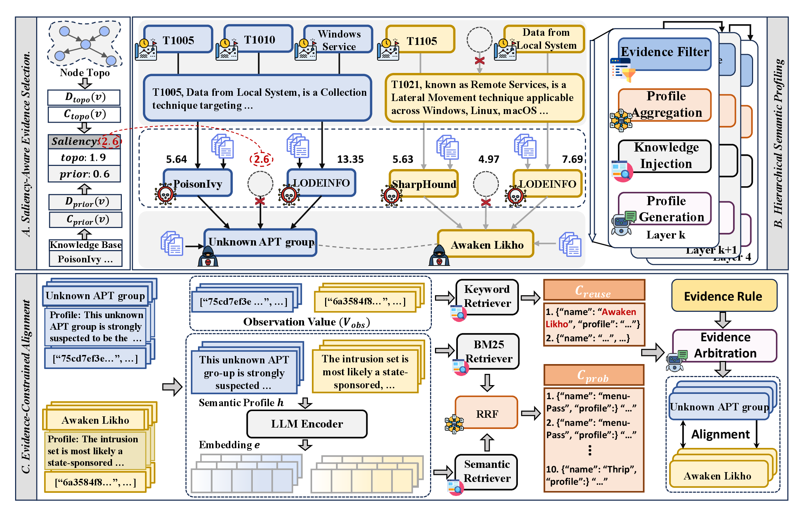

# ThreatAlign

**ThreatAlign** is a zero-shot, open-set threat attribution framework for Cyber Threat Intelligence (CTI). It formulates attribution as **entity-level semantic alignment**: an anonymized actor-centered evidence graph is aligned to a known threat actor in a reference CTI graph.

Unlike conventional report classification, ThreatAlign does not assume that each query is a single report. A query can aggregate evidence from one or more reports, indicators, malware, ATT&CK techniques, vulnerabilities, and other CTI entities around an unknown organization.

<p align="center">
  <a href="docs/figures/threatalign_architecture.pdf">
    
  </a>
</p>

<p align="center">
  <a href="docs/figures/threatalign_architecture.pdf">Architecture PDF</a>
  ·
  <a href="src/data/examples/knowledge_base_sample.json">Knowledge-base sample</a>
  ·
  <a href="src/data/dataset/heaa_random">HEAA random</a>
  ·
  <a href="src/data/dataset/heaa_time">HEAA temporal</a>
</p>

## Highlights

- **Actor-centered attribution.** The input is an unknown actor evidence graph, not necessarily a single report.
- **Layered graph profiling.** Lower-level CTI entities are summarized into profiles and reused as evidence for higher-level attribution.
- **Hybrid retrieval and re-ranking.** Candidate entities are retrieved and then re-ranked with factual and semantic evidence.
- **Processed HEAA release.** The repository includes processed HEAA random and temporal splits for reproducing ThreatAlign experiments.
- **Credential-free public config.** Model names and non-sensitive runtime settings match the experimental setup, while credentials and private service endpoints are empty.

## Repository layout

```text
ThreatAlign/
├── README.md
├── pyproject.toml
├── docs/
│   └── figures/
│       ├── threatalign_architecture.pdf
│       ├── threatalign_architecture.png
│       └── threatalign_architecture_readme.png
└── src/
    ├── threatalign/                 # profiling, retrieval, re-ranking, ablation, evaluation
    ├── data/
    │   ├── dataset/
    │   │   ├── heaa_random/         # processed HEAA random split
    │   │   └── heaa_time/           # processed HEAA temporal split
    │   ├── examples/
    │   │   └── knowledge_base_sample.json
    │   ├── prompt/                  # prompts for profiling and alignment
    │   └── raw_data/json/           # lightweight runtime metadata
    ├── envs/                        # public env templates, no real credentials
    ├── models/
    ├── utils/
    └── config/
```

## Released data

This repository releases **processed CTI knowledge graphs**, not the original report corpus. We do not publish raw knowledge-base reports, crawler outputs, raw web pages, fuzzing/crawling intermediates, historical experiment logs, or the raw-to-graph construction pipeline.

The public data contains the graph artifacts needed by ThreatAlign:

- `traditional_save/{source,target}_attributes.json`: entity attributes for query/source and reference/target graphs;
- `traditional_save/{source,target}_tuples.txt`: tab-separated triples in the form `head_id relation_id tail_id`;
- `traditional_save/{source,target}_relation_map.json`: relation-name to relation-ID mapping;
- `traditional_save/{source,target}_entity_type_id.json`: entity IDs grouped by type;
- `traditional_save/target_source_labels*.json`: alignment labels for evaluation.

Processed graph nodes may include extracted CTI entities, IOCs, aliases, timestamps, and generated profile fields. This is intentional: ThreatAlign operates on actor-centered evidence graphs rather than raw reports.

A compact schema example is provided at:

```text
src/data/examples/knowledge_base_sample.json
```

## Environment

The project uses [Pixi](https://pixi.sh/) for reproducible environments.

```bash
pixi install
```

The checked-in files under `src/envs/` are templates and do not contain real credentials. Before running completion-backed experiments, copy `src/envs/.env.example` to a local environment file or export equivalent variables in your shell.

The public default configuration keeps the experimental model settings while leaving sensitive values empty:

```text
LLM_PLATFORM=sc
SC_MODEL_NAME=deepseek-ai/DeepSeek-V3.2
EMBEDDING=Qwen/Qwen3-Embedding-8B
EMBEDDING_DIMENSION_RAG=1024
EMBEDDING_DIMENSION_ATT=4096
TEMPERATURE=0.3
```

You must configure your own Elasticsearch, Redis/RabbitMQ, and LLM/embedding provider credentials before running the full pipeline.

## Quick start

Commands should be run with `DEBUG` unset if your shell defines it:

```bash
env -u DEBUG pixi run threatalign-heaa-random-check
env -u DEBUG pixi run threatalign-heaa-time-check
```

Full experiments enqueue completion and embedding tasks. Clear stale Celery queues first, start the worker, and pass `--allow-completion` only after checking your service configuration.

```bash
env -u DEBUG pixi run clean
env -u DEBUG pixi run celery
```

In another shell:

```bash
env -u DEBUG pixi run threatalign-heaa-random
env -u DEBUG pixi run threatalign-heaa-time
```

Useful Pixi tasks include:

```bash
env -u DEBUG pixi run threatalign-heaa-random-audit
env -u DEBUG pixi run threatalign-heaa-time-audit
env -u DEBUG pixi run threatalign-heaa-random-ablation
env -u DEBUG pixi run threatalign-heaa-time-ablation
```

The same utilities can also be run as Python modules under `src/threatalign/`.

## Notes for artifact users

- The repository is designed for the public paper artifact and intentionally excludes raw CTI reports.
- Some execution modes require live embedding/completion services and local vector indexes.
- Precomputed vector indexes and historical experiment logs are not part of the public repository.
- The processed HEAA graphs are sufficient for inspecting the released data format and reproducing ThreatAlign runs with a properly configured local environment.

## Citation

Citation information will be added after the paper metadata is finalized.
